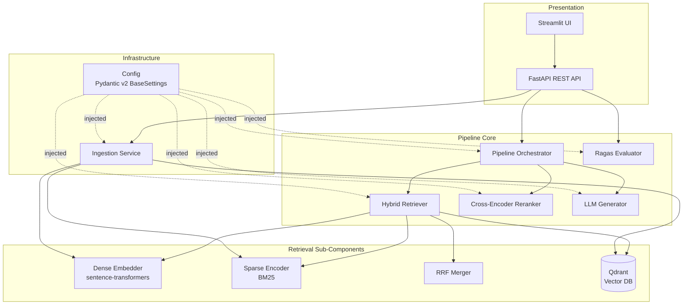

# Design Document: Hybrid RAG Evaluation Pipeline

## Overview

The Hybrid RAG Evaluation Pipeline is a production-grade, modular Python system for document-grounded question answering. It ingests raw text documents, retrieves relevant chunks via hybrid dense+sparse vector search (Qdrant), reranks candidates with a cross-encoder model, generates answers through a configurable LLM backend, and evaluates pipeline quality using the Ragas framework. A FastAPI REST interface and a Streamlit UI expose the pipeline to external consumers. The full system is containerized with Docker Compose and ships with a comprehensive test suite and MkDocs documentation.

**Key design goals:**
- Strict modularity: each pipeline stage is an independent, swappable component.
- Full async execution (`asyncio`) throughout the query path.
- Zero coupling between stages—components communicate only through typed data-transfer objects (DTOs).
- Config-driven behaviour: no hardcoded parameters; all values resolved through a hierarchical Pydantic v2 settings system.
- Testability first: external I/O is dependency-injected so unit tests never touch live services.

---

## Architecture

The system is structured as a layered pipeline with a shared configuration spine and two presentation layers (REST API + Streamlit UI).



### Source Tree Layout

```
hybrid-rag-eval-pipeline/
├── src/
│   ├── config/
│   │   ├── __init__.py
│   │   └── settings.py          # AppSettings + sub-models
│   ├── ingestion/
│   │   ├── __init__.py
│   │   └── ingestor.py          # IngestionService
│   ├── retrieval/
│   │   ├── __init__.py
│   │   ├── dense_embedder.py    # DenseEmbedder
│   │   ├── sparse_encoder.py    # SparseEncoder
│   │   ├── rrf.py               # rrf_merge() pure function
│   │   └── hybrid_retriever.py  # HybridRetriever
│   ├── reranking/
│   │   ├── __init__.py
│   │   └── reranker.py          # CrossEncoderReranker
│   ├── generation/
│   │   ├── __init__.py
│   │   └── generator.py         # LLMGenerator
│   ├── pipeline/
│   │   ├── __init__.py
│   │   └── pipeline.py          # Pipeline orchestrator
│   ├── evaluation/
│   │   ├── __init__.py
│   │   └── evaluator.py         # RagasEvaluator
│   └── api/
│       ├── __init__.py
│       ├── app.py               # FastAPI application factory
│       ├── routers/
│       │   ├── query.py
│       │   ├── ingest.py
│       │   ├── evaluate.py
│       │   └── health.py
│       └── schemas.py           # Pydantic request/response models
├── ui/
│   └── app.py                   # Streamlit application
├── tests/
│   ├── unit/
│   ├── integration/
│   └── property/
├── docs/
├── docker-compose.yml
├── Dockerfile
├── pyproject.toml
└── config.yaml
```

---

## Components and Interfaces

### Config (`src/config/settings.py`)

The configuration system uses `pydantic-settings` v2 with a custom `YamlConfigSettingsSource` to load YAML files as an additional source. Resolution priority (highest to lowest): environment variables → YAML file → `.env` file → model defaults.


```python
class QdrantSettings(BaseModel):
    url: str = "http://localhost:6333"
    collection_name: str = "rag_chunks"
    api_key: Optional[str] = None

class EmbedderSettings(BaseModel):
    model_name: str = "sentence-transformers/all-MiniLM-L6-v2"
    vector_dim: int = 384
    batch_size: int = 64

class SparseEncoderSettings(BaseModel):
    model_name: str = "Qdrant/bm25"

class RerankerSettings(BaseModel):
    model_name: str = "cross-encoder/ms-marco-MiniLM-L-6-v2"
    rerank_top_k: int = 5

class LLMSettings(BaseModel):
    provider: Literal["openai", "ollama", "litellm"] = "openai"
    model_name: str = "gpt-4o-mini"
    max_context_tokens: int = 4096
    stream_response: bool = False
    api_key: Optional[str] = None
    base_url: Optional[str] = None

class RetrievalSettings(BaseModel):
    dense_top_k: int = 20
    sparse_top_k: int = 20
    retrieval_top_k: int = 10
    rrf_k: int = 60

class IngestionSettings(BaseModel):
    chunk_size: int = 512
    chunk_overlap: int = 64
    ingestion_batch_size: int = 100

class EvaluationSettings(BaseModel):
    eval_output_dir: str = "./eval_results"
    eval_sample_size: Optional[int] = None
    random_seed: int = 42
    judge_llm_provider: Literal["openai", "ollama", "litellm"] = "openai"
    judge_llm_model: str = "gpt-4o-mini"
    judge_llm_api_key: Optional[str] = None   # required for openai judge; read from RAGAS_LLM_API_KEY env var if absent
    judge_llm_base_url: Optional[str] = None  # required for ollama/litellm judge

class AppSettings(BaseSettings):
    model_config = SettingsConfigDict(env_file=".env", env_nested_delimiter="__")
    qdrant: QdrantSettings = QdrantSettings()
    embedder: EmbedderSettings = EmbedderSettings()
    sparse_encoder: SparseEncoderSettings = SparseEncoderSettings()
    reranker: RerankerSettings = RerankerSettings()
    llm: LLMSettings = LLMSettings()
    retrieval: RetrievalSettings = RetrievalSettings()
    ingestion: IngestionSettings = IngestionSettings()
    evaluation: EvaluationSettings = EvaluationSettings()

    @classmethod
    def settings_customise_sources(cls, settings_cls, **kwargs):
        yaml_path = os.environ.get("YAML_CONFIG_PATH")
        sources = [kwargs["env_settings"], kwargs["dotenv_settings"]]
        if yaml_path:
            sources.insert(0, YamlConfigSettingsSource(settings_cls, yaml_file=yaml_path))
        return tuple(sources)
```

The YAML source is inserted at the front of the priority chain so YAML values override `.env` defaults but remain overridable by shell environment variables. A missing required key raises `ConfigurationError` (wrapping Pydantic's `ValidationError`) at import time.


### Dense Embedder (`src/retrieval/dense_embedder.py`)

Wraps a `sentence_transformers.SentenceTransformer` model. Exposes:

```python
class DenseEmbedder:
    def encode(self, texts: list[str]) -> list[list[float]]: ...
    async def aencode(self, texts: list[str]) -> list[list[float]]: ...
```

The async variant delegates to a thread-pool executor so it does not block the event loop. Output dimension is fixed by `EmbedderSettings.vector_dim` and validated post-encoding.

### Sparse Encoder (`src/retrieval/sparse_encoder.py`)

Uses `fastembed.SparseTextEmbedding` with the `"Qdrant/bm25"` model. This model tokenises text and computes BM25 term-weights on the fly — no separate corpus-level index or pre-training step is required. The underlying vocabulary and IDF statistics are bundled inside the downloaded model artefact. Exposes:

```python
class SparseEncoder:
    def encode(self, texts: list[str]) -> list[SparseVector]: ...
    async def aencode(self, texts: list[str]) -> list[SparseVector]: ...
```

Each `SparseVector` is a `(indices: list[int], values: list[float])` pair where indices are vocabulary term IDs and values are BM25 term weights. The model is downloaded once on first use via `fastembed` and cached locally; no separate installation step is needed beyond `pip install fastembed`.

### RRF Merger (`src/retrieval/rrf.py`)

A pure function — no I/O, no state. This makes it highly testable.

```python
def rrf_merge(
    dense_results: list[ScoredChunk],
    sparse_results: list[ScoredChunk],
    rrf_k: int,
    top_k: int,
) -> list[ScoredChunk]:
```

**Algorithm:**
1. Assign each chunk a rank in its respective list (1-indexed).
2. Compute `rrf_score(chunk) = Σ_list 1 / (rrf_k + rank_in_list)`.
3. Deduplicate by `chunk_id` — if a chunk appears in both lists, its scores are summed.
4. Sort descending by RRF score.
5. Return top `top_k` results (or all if fewer available).

### Hybrid Retriever (`src/retrieval/hybrid_retriever.py`)

Orchestrates the two search paths and the RRF merger.

```python
class HybridRetriever:
    async def retrieve(self, query: str) -> list[ScoredChunk]: ...
```

Dense and sparse query encoding run concurrently via `asyncio.gather`. Each encoder's result is a list of `ScoredChunk` objects. The Qdrant client is called twice (once per vector type), then `rrf_merge` is applied. The client itself is injected via constructor to enable test mocking.


### Cross-Encoder Reranker (`src/reranking/reranker.py`)

Wraps a `sentence_transformers.CrossEncoder` model. Scoring is done in a single batched forward pass.

```python
class CrossEncoderReranker:
    async def rerank(
        self, query: str, candidates: list[ScoredChunk]
    ) -> list[ScoredChunk]: ...
```

Implementation:
1. Build list of `(query, candidate.text)` pairs.
2. Call `model.predict(pairs)` — single batched call.
3. Attach scores to candidates and sort descending.
4. Truncate to `rerank_top_k`.
5. Wrap in thread-pool executor to avoid blocking the event loop.

### LLM Generator (`src/generation/generator.py`)

Routes to the configured backend via a strategy pattern. Three concrete backends: `OpenAIBackend`, `OllamaBackend`, `LiteLLMBackend`. All share the `LLMBackend` abstract base class.

```python
class LLMGenerator:
    async def generate(
        self, query: str, context: list[str]
    ) -> GenerationResult: ...

    async def stream(
        self, query: str, context: list[str]
    ) -> AsyncGenerator[str, None]: ...
```

Context truncation is applied before prompt construction using a `tiktoken` token counter. The prompt template:

```
System: You are a helpful assistant. Answer using only the provided context.
Context:
{chunk_1}
---
{chunk_2}
...
User: {query}
```

`GenerationResult` dataclass:
```python
@dataclass
class GenerationResult:
    answer: str
    model_id: str
    prompt_tokens: int
    completion_tokens: int
    total_tokens: int
```

### Pipeline Orchestrator (`src/pipeline/pipeline.py`)

```python
class Pipeline:
    async def query(self, query: str, top_k: Optional[int] = None) -> PipelineResult: ...
```

Execution flow:
1. Call `HybridRetriever.retrieve(query)` → `candidates`
2. Call `CrossEncoderReranker.rerank(query, candidates)` → `ranked`
3. Call `LLMGenerator.generate(query, [c.text for c in ranked])` → `result`
4. Wrap in `PipelineResult` with latency measurement.

Any exception from steps 1–3 is caught and re-raised as `PipelineError(step_name=..., cause=...)`. A read-write lock (`asyncio.Lock`) guards against concurrent writes during active queries per Requirement 6.5.

> **Single-process scope**: `asyncio.Lock` protects against concurrent writes only within a single Python process. The application MUST be deployed with a single Uvicorn worker (`uvicorn --workers 1`). Multi-worker or multi-process deployments would require a distributed lock (e.g., Redis-based) — this is out of scope for the current MVP. The `docker-compose.yml` and Dockerfile entrypoint MUST use `--workers 1` explicitly.

```python
@dataclass
class PipelineResult:
    answer: str
    context_chunks: list[ScoredChunk]
    reranked_scores: list[float]
    latency_ms: float
```


### Ingestion Service (`src/ingestion/ingestor.py`)

```python
class IngestionService:
    async def ingest(self, documents: list[Document]) -> IngestionResult: ...
```

Execution flow:
1. Chunk each document using a sliding-window tokenizer (chunk_size, chunk_overlap).
2. Encode all chunks with `DenseEmbedder.aencode()` and `SparseEncoder.aencode()` in parallel.
3. If the Qdrant collection does not exist, create it.
4. Upload chunks in batches of `ingestion_batch_size`. If Qdrant is unreachable, raise `IngestionError` at this step only.

### Ragas Evaluator (`src/evaluation/evaluator.py`)

```python
class RagasEvaluator:
    async def evaluate(self, qa_dataset: list[QAPair]) -> EvaluationReport: ...
```

Execution flow:
1. If `eval_sample_size` is set, sample with `random.seed(random_seed)`.
2. For each question, run `Pipeline.query()`. Collect `(question, answer, contexts, ground_truth)`.
3. Build a `ragas.Dataset` and call `ragas.evaluate()` with `Faithfulness`, `AnswerRelevancy`, `ContextPrecision` metrics.
   - **LLM-as-judge requirement**: `Faithfulness` and `AnswerRelevancy` make LLM calls to score outputs. `RagasEvaluator` MUST configure the Ragas `LLMConfig` using `EvaluationSettings.judge_llm_*` fields before calling `ragas.evaluate()`. If `judge_llm_api_key` is absent and the judge provider is `openai`, `RagasEvaluator` SHALL raise `EvaluationError` with a clear message identifying the missing key before attempting any evaluation.
4. Build `EvaluationReport` with per-question and aggregate scores.
5. Persist JSON to `eval_output_dir / f"report_{timestamp}.json"`.
6. On per-question pipeline errors, record error in report and continue.

```python
@dataclass
class EvaluationReport:
    per_question: list[QuestionResult]
    aggregate: dict[str, float]   # metric_name → mean score
    errors: list[QuestionError]
    timestamp: str
```

### FastAPI Application (`src/api/`)

The FastAPI app is created by a factory function `create_app(settings: AppSettings) -> FastAPI` to enable dependency injection in tests. All pipeline components are instantiated once and stored in `app.state`.

Routers:
- `POST /query` — calls `Pipeline.query()`; supports `stream=true` via SSE.
- `POST /ingest` — calls `IngestionService.ingest()`.
- `POST /evaluate` — calls `RagasEvaluator.evaluate()`.
- `GET /health` — probes Qdrant and LLM backend connectivity.

Global exception handler catches `PipelineError` and returns HTTP 500 with `{"error": str(e), "step": e.step_name}`.

### Streamlit UI (`ui/app.py`)

The UI is a thin client that calls the FastAPI endpoints. It does not import pipeline modules directly. Session state persists `top_k`, `rerank_top_k`, and `provider` settings across reruns. A `st.spinner()` wraps all API calls.

---

## Data Models

All DTOs are Pydantic v2 `BaseModel` or Python `dataclass` objects.

```python
class Document(BaseModel):
    id: str
    text: str
    metadata: dict[str, Any] = {}

class Chunk(BaseModel):
    id: str           # "{document_id}_{chunk_index}"
    document_id: str
    text: str
    metadata: dict[str, Any] = {}
    chunk_index: int

class ScoredChunk(BaseModel):
    chunk: Chunk
    score: float      # RRF score pre-rerank; cross-encoder score post-rerank

class QAPair(BaseModel):
    question: str
    ground_truth: str
    metadata: dict[str, Any] = {}
```

**Qdrant Payload Schema** (stored per point):
```json
{
  "chunk_id": "doc_abc_0",
  "document_id": "doc_abc",
  "text": "...",
  "chunk_index": 0,
  "metadata": {}
}
```

Qdrant is configured with two named vectors per collection:
- `"dense"`: `VectorParams(size=384, distance=Distance.COSINE)`
- `"sparse"`: `SparseVectorParams(modifier=Modifier.IDF)`


---

## Correctness Properties

*A property is a characteristic or behavior that should hold true across all valid executions of a system — essentially, a formal statement about what the system should do. Properties serve as the bridge between human-readable specifications and machine-verifiable correctness guarantees.*

### Property 1: YAML configuration overrides .env defaults

*For any* configuration key present in both a `.env` file and a YAML file, loading `AppSettings` with `YAML_CONFIG_PATH` pointing to that YAML file SHALL produce the value from the YAML file, not the `.env` file.

**Validates: Requirements 1.1**

### Property 2: Missing required key produces named ConfigurationError

*For any* required configuration key that is absent from all configuration sources, constructing `AppSettings` SHALL raise a `ConfigurationError` whose message contains the exact name of the missing key.

**Validates: Requirements 1.2**

### Property 3: Chunking produces correctly sized and overlapping chunks

*For any* document text, `chunk_size` value, and `chunk_overlap` value, the chunking function SHALL produce chunks where: (a) every chunk contains at most `chunk_size` tokens, (b) consecutive chunk pairs share exactly `chunk_overlap` tokens at their boundary, and (c) the concatenation of all unique token regions covers the entire original document.

**Validates: Requirements 2.1**

### Property 4: Dense embedding dimension matches configured model

*For any* non-empty chunk text, `DenseEmbedder.encode()` SHALL return a vector whose length equals `EmbedderSettings.vector_dim`.

**Validates: Requirements 2.2**

### Property 5: Sparse encoding produces non-empty term-weight vectors

*For any* non-empty chunk text, `SparseEncoder.encode()` SHALL return a `SparseVector` with at least one non-zero term weight.

**Validates: Requirements 2.3**

### Property 6: Ingestion stores all chunks without data loss

*For any* list of N chunks and any `ingestion_batch_size` B (including B < N), the total number of chunk payloads delivered to the Qdrant upsert interface SHALL equal N, and each payload SHALL contain a dense vector, a sparse vector, and the original chunk metadata.

**Validates: Requirements 2.4, 2.6**

### Property 7: RRF merge correctness — no data loss, correct scores, deduplication, and sorted output

*For any* two lists of `ScoredChunk` results (dense and sparse), `rrf_merge()` SHALL: (a) include every unique chunk ID that appeared in either input list, (b) assign each chunk the score `Σ 1/(rrf_k + rank_i)` summed over its appearances across lists, (c) contain each chunk ID at most once, and (d) return results sorted by descending RRF score, truncated to `top_k` (or fewer if the merged set is smaller).

**Validates: Requirements 3.3, 3.4, 3.5, 10.5**

### Property 8: Reranker output is a sorted, truncated subset of input

*For any* query string, list of candidate chunks, and `rerank_top_k` value, `CrossEncoderReranker.rerank()` SHALL: (a) return only chunk IDs present in the input list (no hallucinated chunks), (b) return results sorted by descending cross-encoder score, (c) return at most `min(rerank_top_k, len(input))` candidates, and (d) produce identical output order for all permutations of the same input list given fixed model weights.

**Validates: Requirements 4.2, 4.3, 4.6, 4.7**

### Property 9: Prompt contains all context texts and the query

*For any* query string and non-empty context list, the prompt constructed by `LLMGenerator` SHALL contain the query string and every context text from the list as substrings.

**Validates: Requirements 5.1**

### Property 10: GenerationResult always contains answer, model ID, and token usage

*For any* successful LLM backend response, `LLMGenerator.generate()` SHALL return a `GenerationResult` where `answer`, `model_id`, `prompt_tokens`, `completion_tokens`, and `total_tokens` are all populated with non-None values.

**Validates: Requirements 5.3**

### Property 11: Any LLM backend error raises GenerationError

*For any* HTTP error status code returned by the LLM backend, `LLMGenerator.generate()` SHALL raise a `GenerationError` that includes the upstream error message and status code.

**Validates: Requirements 5.5**

### Property 12: Context truncation respects max_context_tokens

*For any* context list whose total token count exceeds `max_context_tokens`, the truncated context passed to prompt construction SHALL have a total token count ≤ `max_context_tokens`.

**Validates: Requirements 5.6**

### Property 13: PipelineResult always contains all required fields

*For any* successful query through the Pipeline, the returned `PipelineResult` SHALL have non-None values for `answer`, `context_chunks`, `reranked_scores`, and `latency_ms`.

**Validates: Requirements 6.2**

### Property 14: Pipeline step errors are wrapped in PipelineError with step name

*For any* of the three pipeline steps (retriever, reranker, generator) and any exception type that step raises, `Pipeline.query()` SHALL raise a `PipelineError` where `cause` wraps the original exception and `step_name` equals the name of the failing step.

**Validates: Requirements 6.3**

### Property 15: Evaluator processes all questions and records errors without stopping

*For any* QA dataset with K pipeline failures at arbitrary positions, `RagasEvaluator.evaluate()` SHALL complete evaluation for all remaining questions and the resulting `EvaluationReport` SHALL contain exactly K error entries and `(N - K)` scored question entries.

**Validates: Requirements 7.3, 7.5**

### Property 16: EvaluationReport persists as lossless JSON round-trip

*For any* `EvaluationReport`, serializing it to JSON and deserializing from the file at `eval_output_dir` SHALL produce an object equal to the original report (all per-question scores, aggregate means, and error entries preserved).

**Validates: Requirements 7.4**

### Property 17: Evaluation sampling is reproducible across runs with the same seed

*For any* QA dataset of size N, `eval_sample_size` S ≤ N, and random seed R, two separate calls to `RagasEvaluator.evaluate()` with the same (N, S, R) SHALL select an identical set of questions.

**Validates: Requirements 7.6, 7.7**

### Property 18: API returns HTTP 422 for any invalid request body

*For any* request body that violates the Pydantic schema of `/query`, `/ingest`, or `/evaluate`, the API SHALL return HTTP 422 with a JSON error body describing the validation failures.

**Validates: Requirements 8.5**

### Property 19: API returns HTTP 500 with step name for any PipelineError

*For any* `PipelineError` raised during a request, the API SHALL return HTTP 500 with a JSON body containing both the error message and the `step_name` from the `PipelineError`.

**Validates: Requirements 8.6**


---

## Error Handling

The system uses a typed exception hierarchy rooted in `HybridRAGError`. Each layer wraps upstream exceptions rather than swallowing them.

```
HybridRAGError
├── ConfigurationError        # raised by AppSettings on missing/invalid config
├── IngestionError            # raised by IngestionService on Qdrant write failure
├── RetrievalError            # raised by HybridRetriever on Qdrant query failure
├── RerankerError             # raised by CrossEncoderReranker on model failure
├── GenerationError           # raised by LLMGenerator on backend error
│   └── StreamingError        # sub-type: error mid-stream
├── PipelineError             # raised by Pipeline; wraps any step error
│   ├── step_name: str        # "retriever" | "reranker" | "generator"
│   └── cause: Exception
└── EvaluationError           # raised by RagasEvaluator on fatal eval failure
```

### Error Handling per Component

| Component | Trigger | Error Type | Behaviour |
|---|---|---|---|
| `AppSettings` | Missing required key | `ConfigurationError` | Raised at import time; app fails to start |
| `IngestionService` | Qdrant unreachable | `IngestionError` | Raised only after chunking+encoding complete |
| `HybridRetriever` | Qdrant query failure | `RetrievalError` | Propagated to Pipeline |
| `CrossEncoderReranker` | Model forward pass fails | `RerankerError` | Propagated to Pipeline |
| `LLMGenerator` | Backend error response | `GenerationError` | Includes HTTP status + upstream message |
| `LLMGenerator` | Error during streaming | `StreamingError` | Partial tokens discarded; server sends `event: error` SSE frame, then closes stream |
| `Pipeline` | Any step error | `PipelineError` | Wraps cause; identifies step by name |
| `RagasEvaluator` | Per-question error | Recorded in report | Evaluation continues for remaining questions |
| `RagasEvaluator` | Fatal ragas failure | `EvaluationError` | Propagated to API |
| FastAPI | `PipelineError` | HTTP 500 | JSON `{"error": ..., "step": ...}` |
| FastAPI | Pydantic validation error | HTTP 422 | Auto-generated by FastAPI |
| FastAPI | `/docs` generation fails | Warning logged | Startup continues; `/health` unaffected |

### Streaming error protocol

When a `StreamingError` occurs mid-stream, the API router MUST:
1. Stop forwarding tokens immediately.
2. Send a final SSE frame: `event: error\ndata: {"detail": "<error message>"}\n\n`.
3. Close the response stream.

Clients (Streamlit UI and any external consumers) MUST handle `event: error` frames and display the error message rather than treating a silent stream termination as a successful response.

On application startup, the API service probes Qdrant with exponential back-off:
- Attempts: up to 5
- Delays: 1s, 2s, 4s, 8s, 16s
- After 5 failures: raises `ConfigurationError` and exits with non-zero code.

---

## Testing Strategy

### Philosophy

Two complementary test layers:
- **Unit tests** (`tests/unit/`): test each component in isolation with all external I/O mocked. Fast (< 2s total). No network, no filesystem.
- **Property-based tests** (`tests/property/`): use `hypothesis` to generate random inputs and verify universal invariants across 100+ iterations. Mocks replace external services.
- **Integration tests** (`tests/integration/`): test API endpoints with FastAPI's `TestClient`, mocking the pipeline. Verify HTTP contracts.

All async tests use `pytest-asyncio`. Coverage target: ≥ 80% line coverage via `pytest-cov` across `src/`.

### Property-Based Test Configuration

Library: `hypothesis` (Python). Each property test is tagged with a comment referencing the design property it implements.

Tag format: `# Feature: hybrid-rag-eval-pipeline, Property {N}: {property_text}`

Minimum iterations: 100 per property (Hypothesis default `max_examples=100`).

### Property Test Mapping

| Property | Test Module | Hypothesis Strategies |
|---|---|---|
| P1: YAML overrides .env | `tests/property/test_config_props.py` | `st.text()`, `st.integers()`, `st.floats()` for config values |
| P2: Missing key error | `tests/property/test_config_props.py` | `st.sampled_from(required_keys)` |
| P3: Chunking correctness | `tests/property/test_ingestion_props.py` | `st.text(min_size=1)`, `st.integers(50, 512)` for chunk_size |
| P4: Dense embedding dim | `tests/property/test_embedder_props.py` | `st.text(min_size=1)` for chunk texts |
| P5: Sparse encoding non-empty | `tests/property/test_sparse_props.py` | `st.text(min_size=1)` for chunk texts |
| P6: Ingestion no data loss | `tests/property/test_ingestion_props.py` | `st.lists(chunk_strategy, min_size=1)`, `st.integers(1, 50)` for batch_size |
| P7: RRF correctness | `tests/property/test_rrf_props.py` | `st.lists(chunk_id_strategy)` for dense/sparse result lists |
| P8: Reranker invariants | `tests/property/test_reranker_props.py` | `st.lists(chunk_strategy, min_size=1)`, `st.integers(1, 20)` for top_k |
| P9: Prompt completeness | `tests/property/test_generator_props.py` | `st.text()` for query, `st.lists(st.text(), min_size=1)` for context |
| P10: GenerationResult fields | `tests/property/test_generator_props.py` | Random mock LLM responses |
| P11: LLM error → GenerationError | `tests/property/test_generator_props.py` | `st.sampled_from([400,401,429,500,503])` for error codes |
| P12: Context truncation | `tests/property/test_generator_props.py` | `st.lists(st.text())`, `st.integers(100, 4096)` for max_tokens |
| P13: PipelineResult fields | `tests/property/test_pipeline_props.py` | Random queries via `st.text()` |
| P14: PipelineError wrapping | `tests/property/test_pipeline_props.py` | `st.sampled_from(["retriever","reranker","generator"])`, `st.from_type(Exception)` |
| P15: Evaluator continues on error | `tests/property/test_evaluator_props.py` | `st.lists(qa_pair_strategy)`, random failure indices |
| P16: EvaluationReport round-trip | `tests/property/test_evaluator_props.py` | Random mock ragas outputs |
| P17: Sampling reproducibility | `tests/property/test_evaluator_props.py` | `st.integers()` for seed, `st.lists()` for dataset |
| P18: API 422 on invalid body | `tests/property/test_api_props.py` | `st.fixed_dictionaries` with wrong types |
| P19: API 500 with step name | `tests/property/test_api_props.py` | `st.sampled_from(step_names)` |

### Unit Test Coverage Targets

| Module | Key Unit Test Scenarios |
|---|---|
| `config/settings.py` | YAML override, missing key, wrong type, sub-model instantiation |
| `ingestion/ingestor.py` | chunk splitting, batch upload, collection creation, Qdrant error |
| `retrieval/rrf.py` | empty inputs, fully overlapping lists, single-list input |
| `retrieval/hybrid_retriever.py` | both encoders called, Qdrant called twice, output sorted |
| `reranking/reranker.py` | single batched call, truncation, top_k > input length |
| `generation/generator.py` | all three providers, streaming happy path, streaming error |
| `pipeline/pipeline.py` | execution order, step error wrapping, PipelineResult fields |
| `evaluation/evaluator.py` | sample with seed, per-question error recording, JSON persist |

### Integration Test Coverage

| Endpoint | Scenarios |
|---|---|
| `POST /query` | valid body → 200; invalid body → 422; pipeline error → 500; stream=true → SSE |
| `POST /ingest` | valid body → 200; invalid body → 422 |
| `POST /evaluate` | valid body → 200; invalid body → 422 |
| `GET /health` | all deps healthy → 200 {"status":"ok"}; Qdrant down → 503 |

### Test Isolation Strategy

- Qdrant: replaced by `unittest.mock.AsyncMock` that returns configured fixtures.
- LLM backends: replaced by mock that returns a canned `GenerationResult`.
- `sentence_transformers` models: replaced by mocks returning fixed-dimension zero vectors.
- `CrossEncoder`: replaced by mock that returns deterministic scores.
- `ragas.evaluate()`: replaced by mock returning fixed metric scores.
- File I/O in evaluator: uses `tmp_path` pytest fixture.
- FastAPI app: instantiated with all mocked dependencies via `create_app(settings, **mocked_deps)`.

