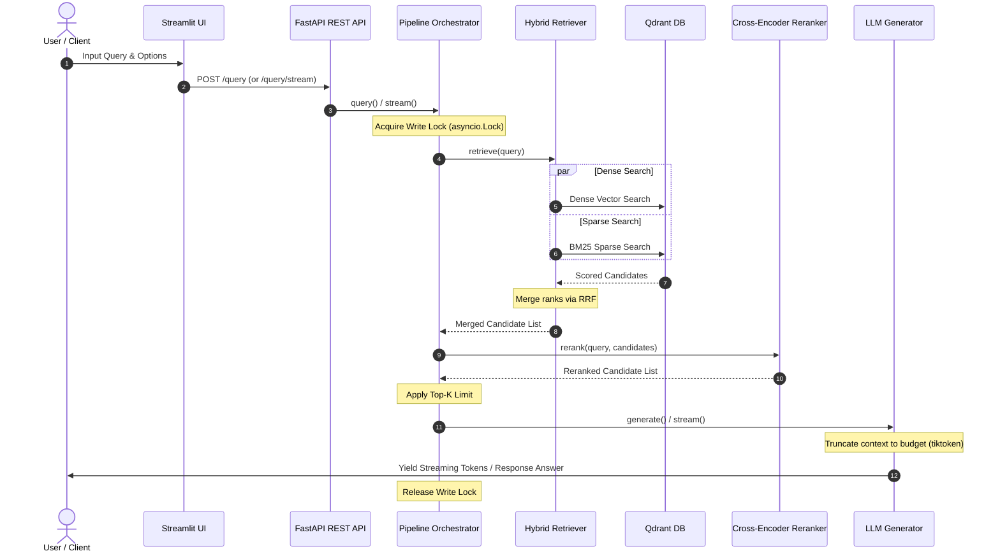

# Hybrid RAG Assistant with Cross-Encoder Reranking and Ragas Evaluation

A production-grade, containerised Hybrid Retrieval-Augmented Generation (RAG) assistant pipeline. This project implements dual-vector retrieval (Dense Embeddings + BM25 Sparse Vectors), Reciprocal Rank Fusion (RRF) rank merging, Cross-Encoder reranking, LLM response generation (supporting OpenAI, Ollama, and LiteLLM) with token-budget truncation, and automated evaluation using the Ragas framework.

---

## Architecture Diagram

The diagram below outlines the end-to-end execution flow of a query passing through the orchestrator pipeline:



---

## Features

- **Concurrent Hybrid Search**: Runs dense vector embedding searches (via sentence-transformers) and sparse term searches (via FastEmbed BM25) in parallel.
- **Reciprocal Rank Fusion (RRF)**: Merges ranked results from both retrieval backends into a unified list.
- **Cross-Encoder Reranking**: Executes Cross-Encoder model inference using a thread-pool executor to re-score and re-rank context candidates.
- **Robust Generative Backends**: Connects to OpenAI, Ollama, or LiteLLM. Implements tiktoken-based sliding token truncation to respect the LLM's context budget.
- **Ragas Evaluation**: Programmatic evaluation (Faithfulness, Answer Relevancy, Context Precision) with reproducible dataset sampling and error-resilient iteration.
- **FastAPI REST API**: Comprehensive REST API equipped with schemas, health checks, query execution, streaming endpoints, ingestion services, and evaluation triggers.
- **Streamlit Dashboard**: Modern, thin client dashboard with real-time streaming toggle, metadata expanders, and evaluation upload panels.

---

## Quickstart Guide

### Prerequisites
- Docker and Docker Compose installed.
- (Optional) An OpenAI API key or a running Ollama service.

### Launching the Application
1. **Set Environment Variables**:
   Copy `.env.example` to `.env` and fill in your keys:
   ```bash
   cp .env.example .env
   ```

2. **Run Services**:
   Spin up Qdrant, FastAPI, and Streamlit containers:
   ```bash
   docker-compose up --build
   ```

3. **Verify running services**:
   - **Streamlit Dashboard**: [http://localhost:8501](http://localhost:8501)
   - **FastAPI Documentation**: [http://localhost:8000/docs](http://localhost:8000/docs)
   - **Qdrant Dashboard**: [http://localhost:6333/dashboard](http://localhost:6333/dashboard)

---

## Configuration Overview

Configuration parameters are declared in `config.yaml` and can be overridden via environment variables.

Key groups:
- **`qdrant`**: Host URL, Collection Name, and API keys.
- **`embedder`**: HuggingFace dense model name and dimension configuration.
- **`sparse_encoder`**: BM25 model identifier.
- **`reranker`**: Cross-Encoder model name and limit values.
- **`llm`**: Provider name (`openai`, `ollama`, `litellm`), Model name, URL overrides, and API keys.
- **`retrieval`**: Dense and Sparse top_k limits, RRF constant.
- **`evaluation`**: Ragas sample size, random seed, judge LLM provider.

---

## Testing Instructions

Unit tests are written in `pytest` and target all major components.

### Run Local Unit Tests
To run tests locally, install the development dependencies and trigger `pytest`:
```bash
python -m venv .venv
source .venv/bin/activate  # Or .venv\Scripts\activate on Windows
pip install -e ".[dev]"
pytest
```
